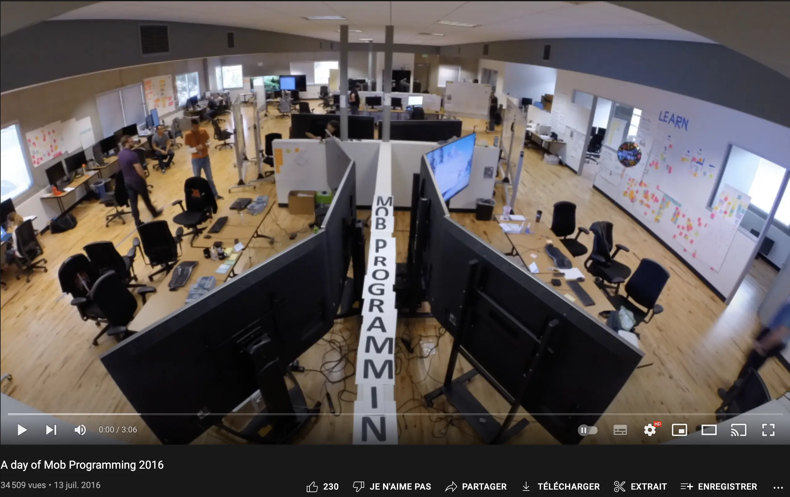
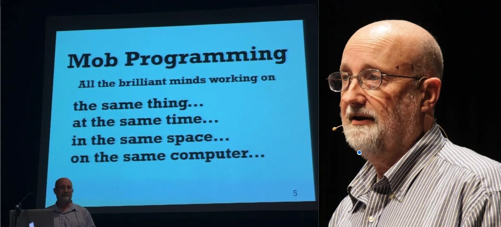
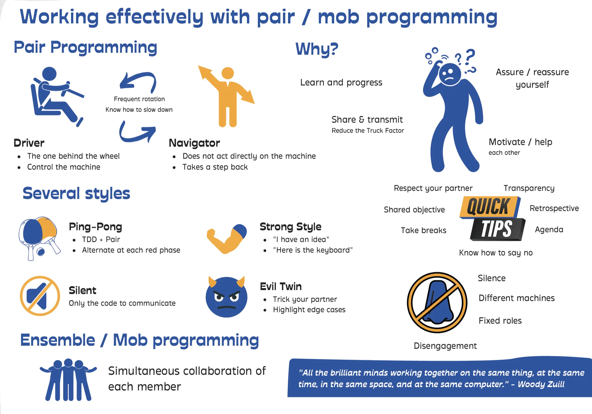
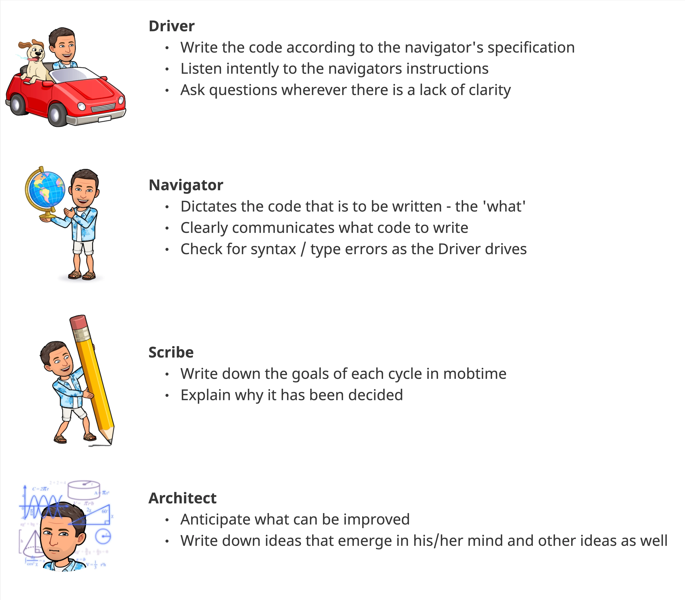

# Mob Programming
## Connection - Web Hunt (10')
In pairs, deep dive into the workshop topic - 5':
- What is `mob programming`? 
  - What is the difference between `mob programming` and `ensemble programming`?
- What values can it bring?

Group sharing - 5'

## Concepts

- What did you see?
- What do you think about it?
- What about the roles?
- What about meetings?

> No delays, a real flow

### Use cases
- Create a new project / solution / system
  - Do it as a mob, it:
    - Involves every team member in decisions taking
    - Shares instantly knowledge inside the team
    - Allows to create the best system possible: "alone we go faster together we go further"
- Open a new `User Story`
  - You can do it as a whole team
  - Instead of having big discussions on how to split it theoretically
    - Take some times in mob and design the solution together
    - Put some `TODOs` in the code that represents the work to do
  - By doing so, you will agree before the implementation on what and how to do it
    - Spending much less time in `code reviews` later on
- On-board new joiners on your team standards

## Concrete Practice - Yatzy
### Kata

### Review
At the end, each mob presents the new version of the production code

## Conclusion - Reflect
Take a few minutes to reflect and ask questions :
- What did you learn from this kata and from the mob?
- How does it differ to your current way of working?
- How mob programming could be applied in your current context?
  - When?
- What would you expect from it?

## Resources
- [Mob Programming - A Whole Team Approach by Woody Zuill](https://leanpub.com/mobprogramming)
- [The Surprisingly Inclusive Benefits of Mob Programming at Cucumber](https://cucumber.io/blog/bdd/inclusive-benefits-of-mob-programming/)
- [Puzzle-Driven Development](https://www.yegor256.com/2010/03/04/pdd.html)
- [Crappy-Driven Development](https://github.com/ythirion/crappy-driven-development)
- [Mobtime](https://mobti.me/)
- [Ensemble Enablers](https://proagileab.github.io/EnsembleEnablers/)
